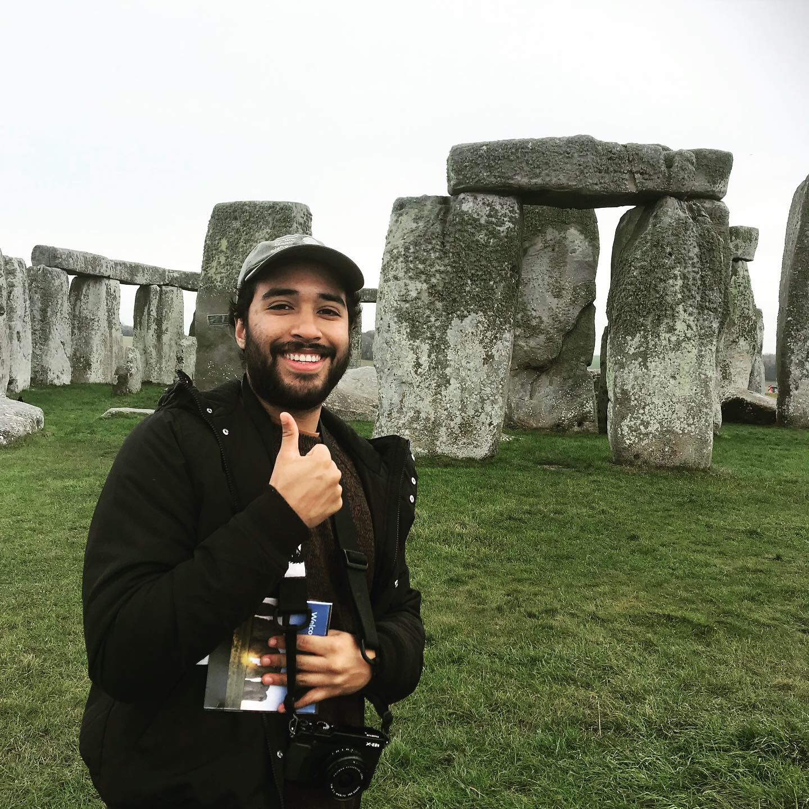

## Bio

I work as a data scientist at <a href="https://www.esri.com/en-us/home" target="_blank">Esri</a> developing models for market research and user analytics. I recently finished a M.S. in Mathematics with a concentration in Statistics at Cal Poly Pomona, where my thesis explored the performance of deep neural networks combined with Gaussian processes for [aircraft detection](https://github.com/hakeemtfrank/aircraft-detection) in aerial imagery. I was advised by <a href="https://www.reddit.com/r/ac_newhorizons/comments/giikrj/for_our_online_final_my_professor_invited_us_to/" target="_blank">Dr. Jimmy Risk</a>. 

Previously I conducted research in computational fluid dynamics at Tulane University under <a href="https://sites.google.com/view/alexanderphoover" target="_blank">Dr. Alexander Hoover</a>, <a href="https://sse.tulane.edu/math/faculty/cortez" target="_blank">Dr. Ricardo Cortez</a> and <a href="https://en.wikipedia.org/wiki/Lisa_Fauci" target="_blank">Dr. Lisa Fauci</a>. Our work investigated optimal mechanics of flying and swimming animals using the immersed boundary method and high performance computing on Tulane's <a href="https://wiki.hpc.tulane.edu/trac/wiki/cypress" target="_blank">giant supercomputer</a>.

I love playing the guitar, going to concerts, and listening to all kinds of music (132,014 minutes listened in 2020). I'm also an amateur [photographer](https://www.flickr.com/photos/hakeemtonalli) and [farmer](https://bacchustales.com/sites/default/files/IMG_2103%20%282%29.JPG).

---

## Contact

**Email:** hakeemtfrank [at] gmail [dot] com
* <a href="https://www.youtube.com/watch?v=dQw4w9WgXcQ&ab_channel=RickAstleyVEVO" target="_blank">CV</a>
* <a href="https://github.com/hakeemtfrank" target="_blank">Github</a>
* <a href="https://www.linkedin.com/in/hakeemtfrank/" target="_blank">LinkedIn</a>
* <a href="https://scholar.google.com/citations?user=hkq6W-AAAAAJ&hl=en&oi=sra" target="_blank">Google Scholar</a>