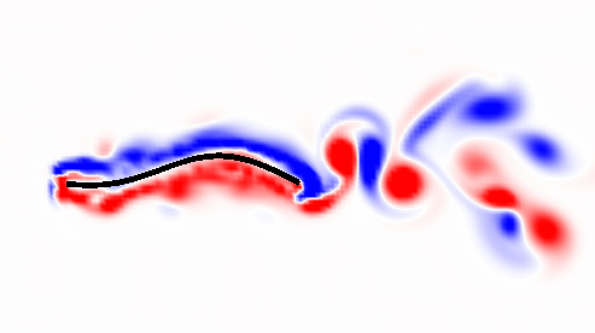

## Research

---

### Aircraft Detection Using Deep Residual Neural Networks and Gaussian Process Classification

Supervised learning is the task of finding a function f (x) that maps an input x to an output y using observed data. Gaussian process models approach supervised learning by assuming a probability over every possible function, using observed data to update the space of functions to consider using Bayes theorem, and taking the expected value of the space of functions to get an estimate for f (x). While Gaussian process models are commonly used in time series and regression domains, they can extend to classification tasks using a response function and variational inference. This work investigates Gaussian process models for image classification tasks using a class of non-stationary kernels that are particularly useful for local feature representations. 
 
<li><a href="https://github.com/hakeemtfrank/aircraft-detection" target="_blank">[Code]</a></li>

---
### Optimizing the Propulsive Performance of Heaving Panels with Nonuniform Elastic Profiles

Recent studies have observed that many animals with flexible appendages follow bending kinematics that transcend animal taxa and fluid medium. In this study we examine the motion of the flexible appendages by deriving mathematical models for the motion of flexible panels using a network of springs and beams. To understand the role of the fluid environment, we incorporated our model into the immersed boundary method, which allowed us to simulate heaving panels with a background fluid flow. The panel’s rigidity and heaving frequency were varied across the parameter space and their propulsive performance was recorded. The relationship between their elastic properties and thrust output for uniform panels was then analyzed with respect to Euler-Bernoulli beam equation. Beam mode analysis allowed us to relate effective flexibility, a non-dimensional number stemming from the beam equation, to trailing edge amplitude, which corresponds to optimized thrust output. Local maxima in thrust output correspond with specific effective flexibilities across various beam stiffnesses and frequencies. The study then examined that panels with non-uniform stiffnesses output a higher thrust than those with uniform stiffness of the same values.
 
<li><a href="https://bit.ly/3kxLIFh" target="_blank">[PDF]</a></li>

