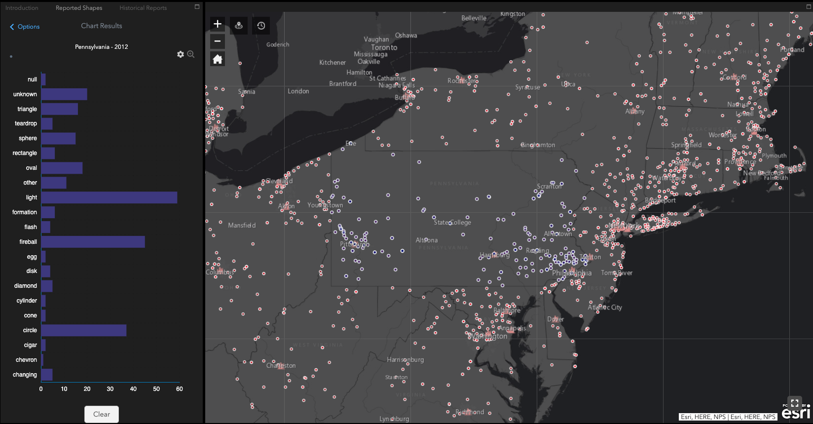

## Maps

---

### Geodemographic Segmentation with Factor Analysis

 
Deeply understanding the patterns and behaviors of consumers has grown significantly in importance with the prevalence of digital advertising. Consequently, data-driven practices in fields such as marketing, psychology, and political science have emerged to meet the demands of this trend. One such practice is geodemographic segmentation, which segments geographic areas based on their underlying demographics using quantitative analysis. This project investigates how the demographics of different postal codes in Louisiana can be segmented using dimensionality reduction techniques. The techniques used in this paper are Principal Components Analysis (PCA), Factor Analysis (EFA), and Linear Discriminant Analysis (LDA). PCA and EFA were used to explore latent variables in the data, while LDA is used to classify postal codes as either predominantly liberal or conservative based on their underlying demographics as an additional experiment. Given a set of demographic and consumer spending variables, the results of our analysis show that there are two distinct factors that can be used to describe the characteristics of each postal code; social livelihood and per-capita spending. We also find that urbanized areas score higher on both factors, while rural areas score low in both factors.

 
<li><a href="https://bit.ly/2VPl2p0" target="_blank">[Web Application]</a></li>

---
### UFO Sightings Web Application

This map shows reports of UFO sightings in the United States for the past century. This map is part of a larger analysis on the NUFORC UFO Sightings dataset published on Kaggle. The dataset contains over 80,000 records of UFO sightings over the past century (between 1910 and 2014), while the interactive part of the dataset only covers the year 2012.

The sightings are represented visually as a heatmap, highlighting significant spots where there was a higher volume of reports during the year. California has the highest amount of UFO reports, with the state of Washington having the second most reports. However, after standardizing the data with respect to the population of each state, California was bumped to 17th place, while Washington moved to first place.
 
<li><a href="https://arcg.is/1OjDbf" target="_blank">[Web Application]</a></li>

