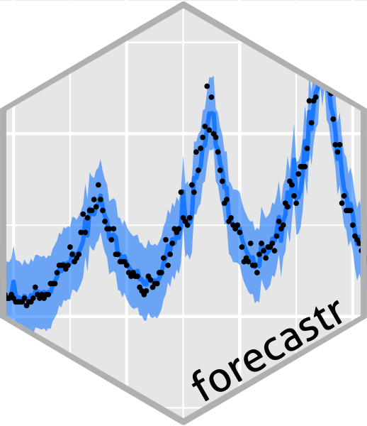

## forecastr 

An <a href="http://hakeemtfrank.github.io/forecastr" target="_blank">introductory guide</a> for doing time series forecasting in R, inspired by <a href="https://otexts.com/fpp2/" target="_blank">Rob Hyndman's text</a> on time series analysis and the Shumway & Stauffer <a href="https://www.stat.pitt.edu/stoffer/tsa4/tsa4.pdf" target="_blank">time series analysis textbook</a>. This guide is designed to walk through a few commonly-used forecasting models for business analytics. It's written for analysts that would like to strengthen their knowledge in building forecasting models and move beyond off-the-shelf forecast tools. 
 
<li><a href="https://github.com/hakeemtfrank/forecastr" target="_blank">[Code]</a> <a href="https://hakeemtfrank.github.io/forecastr/" target="_blank">[Guide]</a> </li>

---
