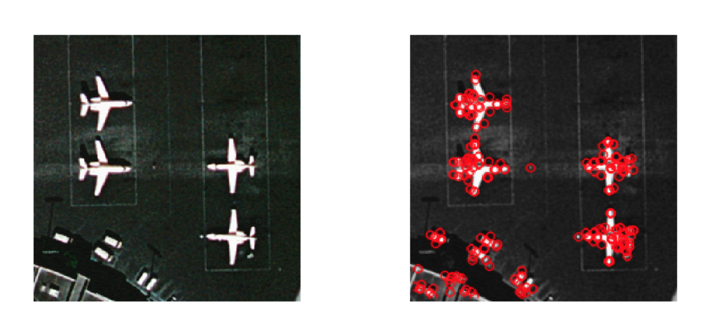
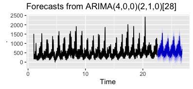
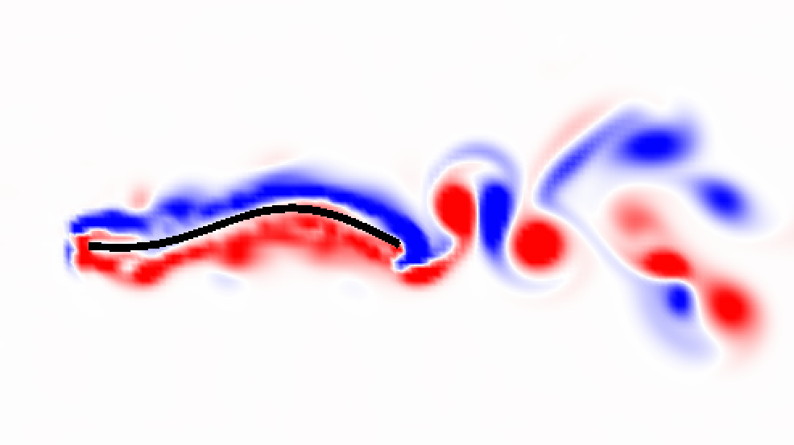
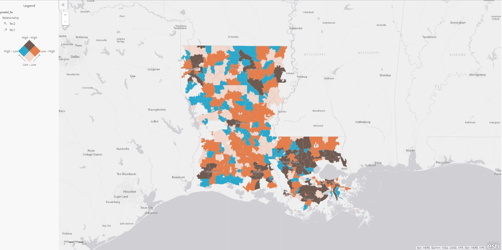
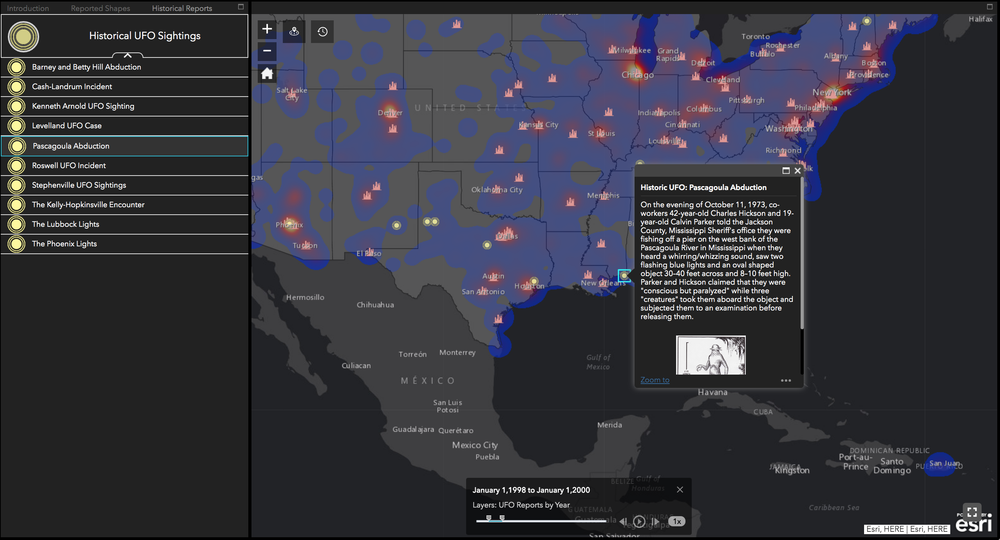

## Projects

### Aircraft Detection Using Deep Residual Neural Networks and Gaussian Process Classification

Supervised learning is the task of finding a function f (x) that maps an input x to an output y using observed data. Gaussian process models approach supervised learning by assuming a probability over every possible function, using observed data to update the space of functions to consider using Bayes theorem, and taking the expected value of the space of functions to get an estimate for f (x). While Gaussian process models are commonly used in time series and regression domains, they can extend to classification tasks using a response function and variational inference. This thesis investigates Gaussian process models for image classification tasks using a class of non-stationary kernels that are particularly useful for local feature representations. Models are evaluated on high-resolution remote sensing imagery, a handwritten digits dataset. and a dataset of X-rays for detecting pneumonia in patients.

<a href="https://bit.ly/31CUGsh" target="_blank">[PDF]</a>

### Predictive Analysis of Rideshare Demand

This project investigates time series models for forecasting rideshare demand in the East Village area of Manhattan for June 2015, using pickup request data from the previous five months. Data was aggregated into 6-hour windows to encourage a normal distribution, and to maintain a useful analysis for drivers that could benefit from identifying optimal working "shifts" during the month. The proposed models were a Seasonal ARIMA (SARIMA) model, Vector Autoregression (VAR) model, and Poisson Generalized Linear Model (Poisson GLM). App prototype built using Streamlit.

<a href="https://bit.ly/31CUGsh" target="_blank">[PDF]</a>

### Optimizing the Propulsive Performance of Heaving Panels with Nonuniform Elastic Profiles

 
Recent studies have observed that many animals with flexible appendages follow bending kinematics that transcend animal taxa and fluid medium. In this study we examine the motion of the flexible appendages by deriving mathematical models for the motion of flexible panels using a network of springs and beams. To understand the role of the fluid environment, we incorporated our model into the immersed boundary method, which allowed us to simulate heaving panels with a background fluid flow. The panel’s rigidity and heaving frequency were varied across the parameter space and their propulsive performance was recorded. The relationship between their elastic properties and thrust output for uniform panels was then analyzed with respect to Euler-Bernoulli beam equation. Beam mode analysis allowed us to relate effective flexibility, a non-dimensional number stemming from the beam equation, to trailing edge amplitude, which corresponds to optimized thrust output. Local maxima in thrust output correspond with specific effective flexibilities across various beam stiffnesses and frequencies. The study then examined that panels with non-uniform stiffnesses output a higher thrust than those with uniform stiffness of the same values.

<a href="https://bit.ly/3kxLIFh" target="_blank">[PDF]</a>

### Geodemographic Segmentation with Factor Analysis

 
Deeply understanding the patterns and behaviors of consumers has grown significantly in importance with the prevalence of digital advertising. Consequently, data-driven practices in fields such as marketing, psychology, and political science have emerged to meet the demands of this trend. One such practice is geodemographic segmentation, which segments geographic areas based on their underlying demographics using quantitative analysis. This project investigates how the demographics of different postal codes in Louisiana can be segmented using dimensionality reduction techniques. The techniques used in this paper are Principal Components Analysis (PCA), Factor Analysis (EFA), and Linear Discriminant Analysis (LDA). PCA and EFA were used to explore latent variables in the data, while LDA is used to classify postal codes as either predominantly liberal or conservative based on their underlying demographics as an additional experiment. Given a set of demographic and consumer spending variables, the results of our analysis show that there are two distinct factors that can be used to describe the characteristics of each postal code; social livelihood and per-capita spending. We also find that urbanized areas score higher on both factors, while rural areas score low in both factors.

<a href="https://bit.ly/2VPl2p0" target="_blank">[Web Application]</a>

### UFO Sightings Web Application

 
This map shows reports of UFO sightings in the United States for the past century. This map is part of a larger analysis on the NUFORC UFO Sightings dataset published on Kaggle. The dataset contains over 80,000 records of UFO sightings over the past century (between 1910 and 2014), while the interactive part of the dataset only covers the year 2012.

The sightings are represented visually as a heatmap, highlighting significant spots where there was a higher volume of reports during the year. California has the highest amount of UFO reports, with the state of Washington having the second most reports. However, after standardizing the data with respect to the population of each state, California was bumped to 17th place, while Washington moved to first place.

<a href="https://arcg.is/1OjDbf" target="_blank">[Web Application]</a>

