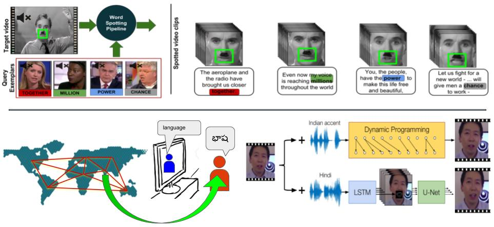
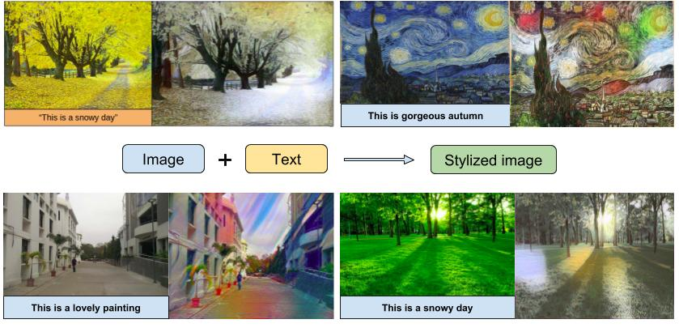
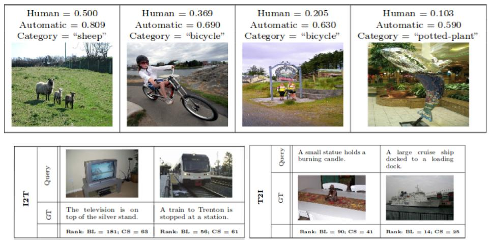
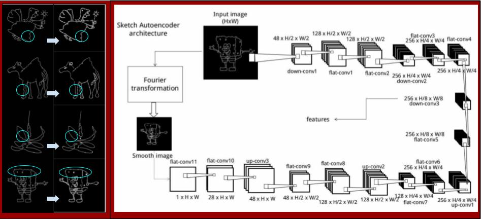

## Projects

***

<h3> 1. Audio Visual Speech Recognition and Synthesis </h3>

<strong>Guide</strong>: Prof. C. V. Jawahar and Prof. Vinay P. Namboodiri.
 
Speech is a multi-modal process, and lip-motion palys a major role in it (See <a href="https://www.youtube.com/watch?v=G-lN8vWm3m0">McGurk effect</a>). Predicting what has been said just by looking at the speaker’s lips can be a boon for a host of application from augmenting audio speech in the medium where the audio noise is significantly limiting the speech, to assisting deaf and other people suffering from auditory disabilities.

On the other hand, we also propose a 'Visual-dubbing' method which re-synchronizes the lips of speaking characters in the foregoing language speech video according to the native language dubbing audio.

**Related Publications:**

<ol class="c">
<li>Abhishek Jha, Vinay Namboodiri and C.V. Jawahar, <strong>Word Spotting in Silent Lip Videos</strong>, IEEE Winter Conference on Applications of Computer Vision (WACV 2018), Lake Tahoe, CA, USA, 2018. <a href="https://cvit.iiit.ac.in/images/ConferencePapers/2018/Word-Spotting-in-Silent-Lip-Videos.pdf">[PDF]</a></li>

<li>Abhishek Jha, Vikram Voleti, Vinay Namboodiri and C.V. Jawahar, <strong>Lip-Synchronization for Dubbed Instructional Videos</strong>, Fine-grained Instructional Video undERstanding (FIVER), CVPR Workshop, Salt Lake City, Utah, USA, 2018. <a href="http://fiver.eecs.umich.edu/abstracts/CVPRW_2018_FIVER_A_Jha.pdf">[PDF]</a></li>
<li>Abhishek Jha, Vinay Namboodiri and C.V. Jawahar, <strong>Spotting Words in Silent Speech Videos : A Retrieval based approach</strong>, Journal of Machine Vision and Applications (MVA), Springer, 2018. <a href="https://drive.google.com/open?id=1PXF46jspuTgMcXnyWcTgA90ABFI0LfyU">[PDF]</a></li>
</ol>

***

 

<h3> 2. Cross-modal Style Transfer </h3>

<strong>Guide</strong>: Prof. Anoop Namboodiri.
 

We develop a method to combine the two modalities, which takes the overall mental imagery in a sentence and automatically impart it to a specific image in a meaningful fashion. The ability to synthesize such images that captures what we describe in the form of natural language is used in a wide range of fields such as education, virtual reality, and advertisement. We propose a method that synthesizes new images by transferring the “style” conveyed by a sentence to a given content image.

**Related Publications:**

<ol class="c">
<li>Sahil Chelaramani, Abhishek Jha and Anoop Namboodiri, <strong>Cross-modal Style Transfer</strong>, IEEE International Conference on Image Processing (ICIP), Athens, Greece, 2018. <a href="https://drive.google.com/file/d/1lT8HNGrsUio9MW87XNattaUz5hsBkXYO/view?usp=sharing">[PDF]</a></li>

</ol>

***

 

<h3> 3. Cross-modal multimedia retrieval</h3>

<strong>Guide</strong>: Prof. C. V. Jawahar.
 

The category of a sample plays a central role in expressing its underlying semantics. If two modalities are known to share a common set of categories, this can be useful in modelling their mutual semantics with respect to each other. We make an attempt towards leveraging this shared information to model cross-modal semantics of a sample. For this, we introduce the notion of cross-specificity. Given collections of samples from two different modalities that share a common set of semantic categories, cross-specificity measures how well a sample in one modality portrays its (categorical)semantics relative to samples that belong to the same category in another modality.

 

**Related Publications:**

<ol class="c">
<li> Yashaswi Verma, Abhishek Jha and C. V. Jawahar, <strong>Cross-specificity: modelling data semantics for cross-modal matching and retrieval</strong>, International Journal of Multimedia Information Retrieval, Springer, June 2018. <a href="https://link.springer.com/article/10.1007/s13735-017-0138-7">[Link]</a></li>

</ol>

***

 

<h3> 4. Sketch simplification for SBIR </h3>

<strong>Guide</strong>: Prof. Vineet Gandhi (Course Project).
 

A key challenge in Sketch based image retrieval systems (SBIR) is to overcome the ambiguity present in the sketch due to human imperfection in sketching, as it being limited user-depective skill. We present an image retrieval system for searching collection of natural images using free-hand sketches that depicts the shape of the object. We create a generalized shape of sketch provided by the user to create a query image, which simplifies the imperfect drawing of human input.

 
 
 

***
