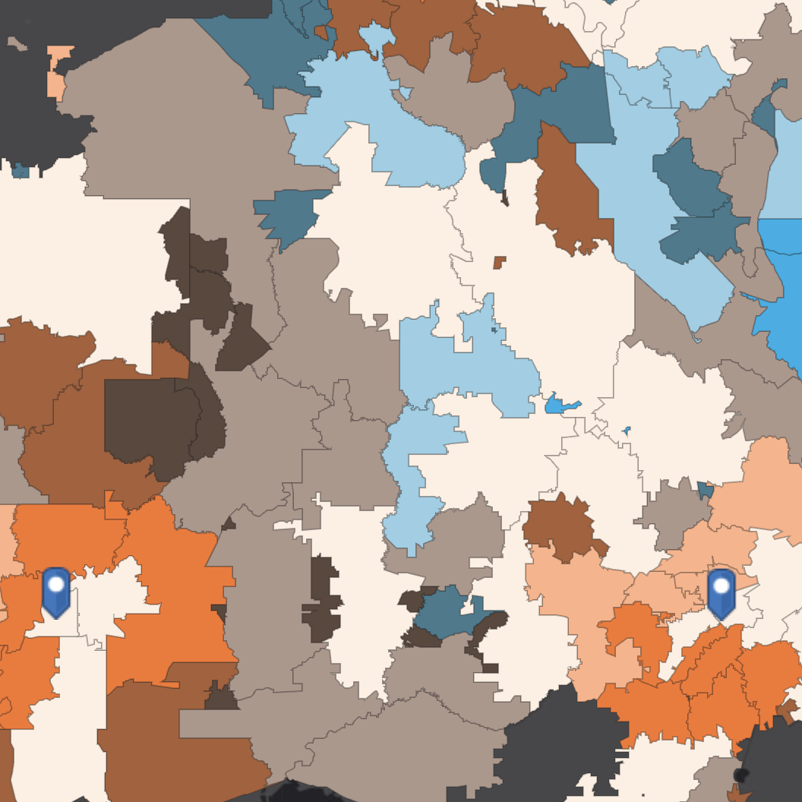

## forecastr 

An <a href="http://hakeemtfrank.github.io/forecastr" target="_blank">introductory guide</a> for doing time series forecasting in R, inspired by <a href="https://otexts.com/fpp2/" target="_blank">Rob Hyndman's text</a> on time series analysis and the Shumway & Stauffer <a href="https://www.stat.pitt.edu/stoffer/tsa4/tsa4.pdf" target="_blank">time series analysis textbook</a>. This guide is designed to walk through a few commonly-used forecasting models for business analytics. It's written for analysts that would like to strengthen their knowledge in building forecasting models and move beyond off-the-shelf forecast tools. 
 
<li><a href="https://github.com/hakeemtfrank/forecastr" target="_blank">[Code]</a> <a href="https://hakeemtfrank.github.io/forecastr/" target="_blank">[Guide]</a> </li>

---

## geodemographic-segmentation 

This project investigates <a href="https://www.esri.com/about/newsroom/publications/wherenext/psychographics-market-analysis-moves-beyond-demographics/" target="_blank">geodemographic segmentation</a>, a market research technique that segments geographic areas based on their underlying demographics using quantitative analysis. Each postal code is enriched with ten consumer spending and demographic variables and analyzed using principal components analysis with a varimax rotation. The results of the analysis show that there are two distinct factors in the data that can be used to describe the characteristics of each postal code; social livelihood and per-capita spending. We also find that urbanized areas score higher on both factors, while rural areas score low in both factors.
 
<li><a href="https://github.com/hakeemtfrank/geodemographic-segmentation" target="_blank">[Code]</a> <a href="https://esrisalesportal.maps.arcgis.com/apps/Minimalist/index.html?appid=29aaebd01ffb44b1870a1a857becc6fd" target="_blank">[Web Map]</a> </li>

